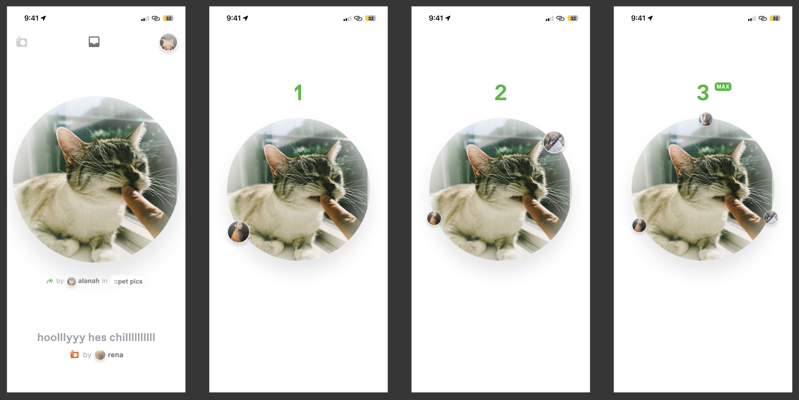

# FP Front-End Challenge

In this task, you’ll build an MVP version of the new **PERMA** image feed in React Native, focusing on gesture-based interactions and displaying a feed of images with attributions.

At FP, we use [Expo](https://expo.dev) to facilitate building and deploying our React Native applications.

## The Task

https://github.com/user-attachments/assets/412e6665-30d2-45e5-bb87-7146ec584fb9

You'll assemble a component called **Feed**, which will allow a user to view images one by one and perform one of two actions for each item in the list:

1. **Forward** to send the item to 1-n users
2. **Discard** to throw the image away

The `Forward` and `Discard` functions do not need to be implemented as part of this task, but should be mocked in order to display screens in response to each action.

The **Feed** will be comprised of the following data:

- A list of `photos`, which you'll cycle through one by one
- A list of `phrases` (max 25 chars), which can be used to choose a random image description for each image
- A list of `threads`, which are essentially a category applied to an image
- A list of `User` objects with a userName and userAvatar, which should be used to attribute the **_forward_** action to a random user

Feel free to generate this data or use external sources.

## Functional Specs

You’ll work with **React Native Gesture Handler** to implement interactions.

-  **For each image**:
    - Display the image
    - Display a `ForwardedBy` component with arrow, user attribution with avatar and username (see `PermaUserLockupFeed`), and thread (see `Tag`)
    - Show the description and photo attribution
- On **Tap + Hold**:
    - Fade out the ForwardedBy and photo description/attribution
    - Scale down the image
    - Add new recipients one by one at 250ms increments, showing the updated count at each interval and adding the new user avatars around the image
- On **Release**:
    - Scale the image back up + show the attributions
- On **Flick Up**:
    - Show a full-screen Forward component for 2_000 ms, then proceed to the next item
- On **Flick Down**:
    - Show a full-screen Discard component for 2_000 ms, then proceed to the next item

## Getting Started

1. **Clone** this repo

## Submit your work

1. **Open a PR** against this repo
2. **Let us know** via email ([`Jayden`](mailto:jw@fp.inc) + [`BJ`](mailto:bj@fp.inc))

## Additional Info

Feel free to use any methodologies you'd incorporate into your typical development flow. Reach out if you have questions or need clarification on any aspect of this challenge. Good luck!
